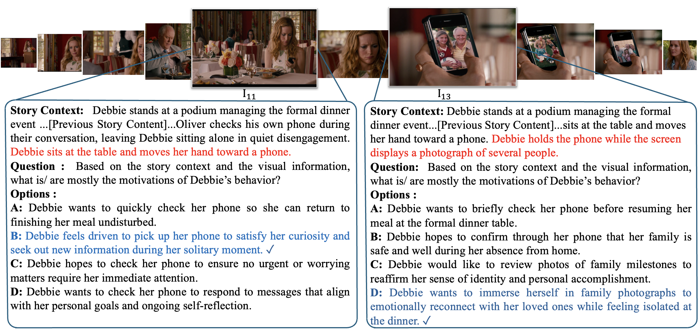
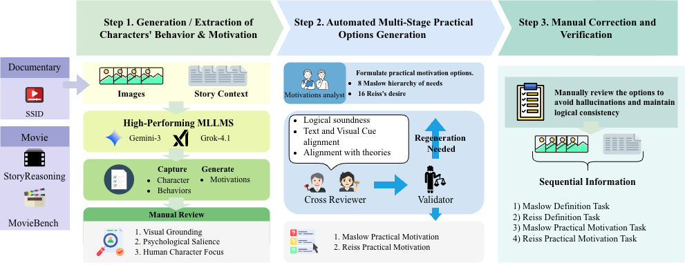
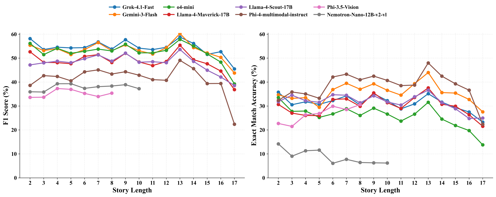
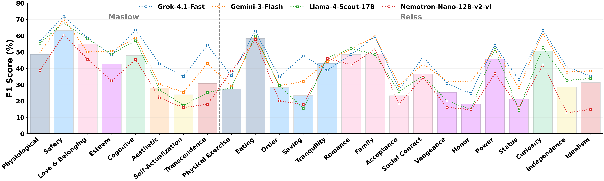
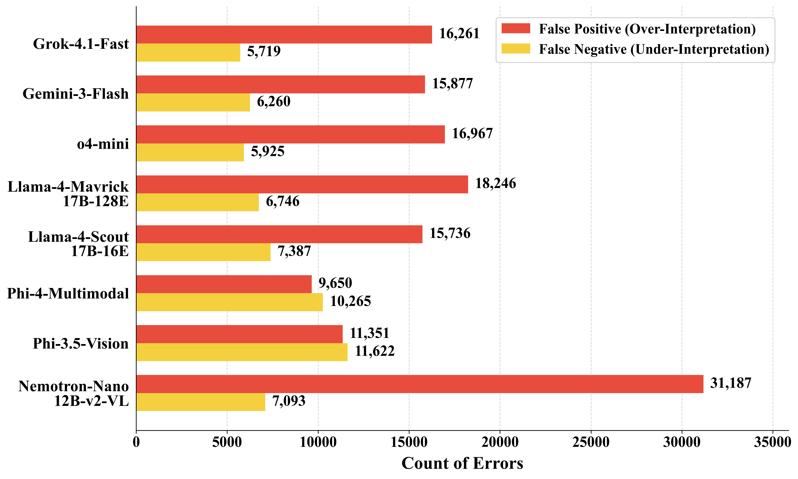

# MulTivationBench

[]()

**MulTivationBench: A Benchmark for Multimodal Sequential Motivation Reasoning**

MulTivationBench evaluates whether multimodal large language models can infer why
characters act as a visual story unfolds. The benchmark asks models to reason
over accumulated images and story context, then infer character motivations
grounded in two psychological frameworks: Maslow's expanded hierarchy of needs
and Reiss's 16 basic desires.



## Benchmark Summary

| Property | Value |
| --- | ---: |
| Visual narratives | 1,000 |
| Character behavior points | 4,023 |
| Evaluation questions | 16,092 |
| Motivation frameworks | Maslow 8-level hierarchy, Reiss 16 basic desires |
| Task types | Definition classification, practical motivation reasoning |
| Input settings | Multimodal, text-only, image-only |

For each visually grounded character behavior, MulTivationBench provides four
multi-label questions:

1. Maslow Definition
2. Maslow Practical Motivation
3. Reiss Definition
4. Reiss Practical Motivation

The key challenge is sequential reasoning: a motivation that appears plausible
from an early visual moment may need to be revised after later story evidence is
observed.

## Construction Pipeline



MulTivationBench is built with an AI-human pipeline:

1. Extract character-centered behavior chains from visual narratives.
2. Generate candidate motivation labels and practical options.
3. Cross-review and validate options for visual grounding, theory alignment, and
   logical soundness.
4. Manually review and correct samples to preserve consistency and reduce
   hallucinated evidence.

## Data And Code

| Path | Purpose |
| --- | --- |
| [data/multivationbench.json](data/multivationbench.json) | Release-safe benchmark JSON with question-answer annotations |
| [data/README.md](data/README.md) | Detailed data recovery and licensing notes |
| [data/mappings/ssid_mapping.json](data/mappings/ssid_mapping.json) | SSID mapping metadata |
| [data/mappings/storyreasoning_mapping.json](data/mappings/storyreasoning_mapping.json) | StoryReasoning mapping metadata |
| [scripts/restore_ssid_content.py](scripts/restore_ssid_content.py) | Restores SSID story content from official SSID downloads |
| [scripts/restore_storyreasoning_content.py](scripts/restore_storyreasoning_content.py) | Restores StoryReasoning content from the upstream source or local cache |
| [scripts/generate_gt_with_story.py](scripts/generate_gt_with_story.py) | Runs the SSID and StoryReasoning restoration pipeline |
| [scripts/download_moviebench.sh](scripts/download_moviebench.sh) | Helper for obtaining MovieBench/LSMDC source clips |
| [src/multivationbench/data.py](src/multivationbench/data.py) | Dataset loading logic used by the recovery workflow |

`data/multivationbench.json` keeps the benchmark annotations while removing source
content that cannot be redistributed directly. SSID and StoryReasoning story
text and question contexts must be reconstructed locally from the upstream
datasets. MovieBench source videos must also be obtained from the upstream
release.

See [docs/DATA.md](docs/DATA.md) for the expected data layout and recovery
commands.

## Quick Start

Inspect the release-safe benchmark file:

```bash
jq '.[0]' data/multivationbench.json
```

Restore SSID and StoryReasoning story content after placing the upstream data in
the expected local layout:

```bash
python scripts/generate_gt_with_story.py \
  --input data/multivationbench.json \
  --output data/multivationbench_with_story.json
```

Run only the SSID restoration:

```bash
python scripts/restore_ssid_content.py \
  --input data/multivationbench.json \
  --mapping data/mappings/ssid_mapping.json \
  --output data/multivationbench.ssid_restored.json
```

Run only the StoryReasoning restoration:

```bash
python scripts/restore_storyreasoning_content.py \
  --input data/multivationbench.json \
  --mapping data/mappings/storyreasoning_mapping.json \
  --output data/multivationbench.storyreasoning_restored.json
```

## Evaluation

MulTivationBench uses multi-label evaluation. A prediction is a set of selected
option letters for each question.

- Exact Match (EM): the predicted option set must exactly match the gold set.
- Example-based F1: partial overlap between predicted and gold option sets is
  rewarded while false positives and false negatives are penalized.



## Main Findings From The Paper

- Current MLLMs remain far from human performance on sequential motivation
  reasoning.
- Text-only inputs can preserve partial F1 performance, but visual evidence is
  important for recovering the exact gold motivation set.
- Story-level consistency is very low: strong instance-level accuracy does not
  reliably translate into stable reasoning over a complete narrative.
- Models perform better on the coarser Maslow taxonomy than on the finer-grained
  Reiss taxonomy.

Additional analysis figures:





## Repository Layout

```text
.
|-- README.md
|-- assets/figures/        # Paper figures used by this README and docs
|-- data/                  # Benchmark JSON and mapping metadata
|-- docs/DATA.md           # Data access, schema, and recovery notes
|-- scripts/               # Data recovery and source download scripts
`-- src/multivationbench/  # Dataset loading utilities
```

## Data And License Notice

MulTivationBench is derived from MovieBench, StoryReasoning, and SSID. This
repository does not grant redistribution rights for upstream images, videos,
story texts, or other source materials. Users must obtain upstream data from the
original sources and follow their licenses.

Only the newly created MulTivationBench question-answer annotations are intended
to be reusable under the authors' release terms. See [docs/DATA.md](docs/DATA.md)
and [data/README.md](data/README.md) before publishing or using the dataset.

## Citation

```bibtex
@misc{chung2026multivationbench,
  title        = {MulTivationBench: A Benchmark for Multimodal Sequential Motivation Reasoning},
  author       = {Chung, Kawai and Chan, Chunkit and Yim, Yauwai and Liu, Yuxuan and Shi, Haochen and Wang, Weiqi and Zong, Qing and Zheng, Tianshi and Fu, Yixuan and Wong, Kai Chung and Liang, Hao and Gao, Yifan and Yang, Xi and Hsiao, Janet Hui-wen and Song, Yangqiu},
  year         = {2026},
  note         = {Manuscript under review}
}
```
